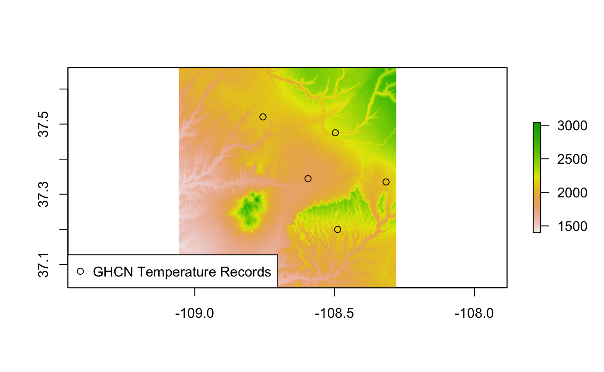
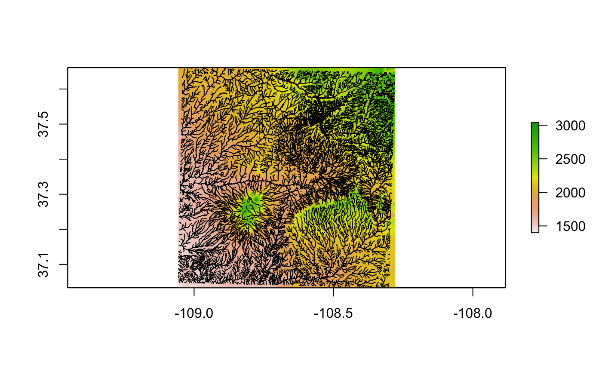
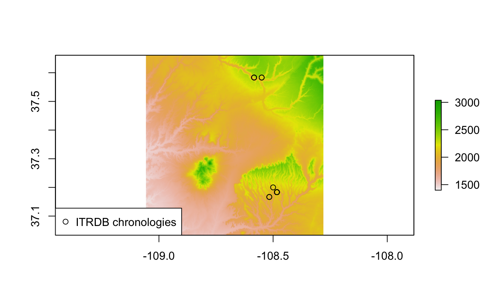

[](https://cran.r-project.org/package=FedData) [](https://github.com/metacran/cranlogs.app) [](https://github.com/metacran/cranlogs.app) [](https://travis-ci.org/ropensci/FedData) <!-- [](https://codecov.io/github/ropensci/FedData?branch=master) --> [](https://zenodo.org/badge/latestdoi/23774237) [](https://github.com/ropensci/onboarding/issues/13)

`FedData` is an *R* package implementing functions to automate downloading geospatial data available from several federated data sources (mainly sources maintained by the US Federal government).

**FedData version 2.4.6 will be the final CRAN release of FedData 2. FedData 3 will be released in the coming months, but some code built on FedData 2 will not be compatible with FedData 3.**

Currently, the package enables extraction from six datasets:

-   The [National Elevation Dataset (NED)](http://ned.usgs.gov) digital elevation models (1 and 1/3 arc-second; USGS)
-   The [National Hydrography Dataset (NHD)](http://nhd.usgs.gov) (USGS)
-   The [Soil Survey Geographic (SSURGO) database](http://websoilsurvey.sc.egov.usda.gov/) from the National Cooperative Soil Survey (NCSS), which is led by the Natural Resources Conservation Service (NRCS) under the USDA,
-   The [Global Historical Climatology Network (GHCN)](http://www.ncdc.noaa.gov/data-access/land-based-station-data/land-based-datasets/global-historical-climatology-network-ghcn), coordinated by National Climatic Data Center at NOAA,
-   The [Daymet](https://daymet.ornl.gov/) gridded estimates of daily weather parameters for North America, version 3, available from the Oak Ridge National Laboratory's Distributed Active Archive Center (DAAC), and
-   The [International Tree Ring Data Bank (ITRDB)](http://www.ncdc.noaa.gov/data-access/paleoclimatology-data/datasets/tree-ring), coordinated by National Climatic Data Center at NOAA.

This package is designed with the large-scale geographic information system (GIS) use-case in mind: cases where the use of dynamic web-services is impractical due to the scale (spatial and/or temporal) of analysis. It functions primarily as a means of downloading tiled or otherwise spatially-defined datasets; additionally, it can preprocess those datasets by extracting data within an area of interest (AoI), defined spatially. It relies heavily on the [**sp**](https://cran.r-project.org/package=sp), [**raster**](https://cran.r-project.org/package=raster), and [**rgdal**](https://cran.r-project.org/package=rgdal) packages.

This package has been built and tested on a source (Homebrew) install of *R* on macOS 10.12 (Sierra), and has been successfully run on Ubuntu 14.04.5 LTS (Trusty), Ubuntu 16.04.1 LTS (Xenial) and binary installs of *R* on Mac OS 10.12 and Windows 10.

### Development

-   [Kyle Bocinsky](http://bocinsky.io) - Crow Canyon Archaeological Center, Cortez, CO

### Contributors

-   Dylan Beaudette - USDA-NRCS Soil Survey Office, Sonora, CA
-   Scott Chamberlain - ROpenSci and Museum of Paleontology at UC Berkeley

### Install `FedData`

-   From CRAN:

    ``` r
    install.packages('FedData')
    ```

-   Development version from GitHub:

    ``` r
    install.packages("devtools")
    devtools::install_github("ropensci/FedData")
    ```

-   Linux (Ubuntu 14.04.5 or 16.04.1):

    First, in terminal:

    ``` bash
    sudo add-apt-repository ppa:ubuntugis/ppa -y
    sudo apt-get update -q
    sudo apt-get install libssl-dev libcurl4-openssl-dev netcdf-bin libnetcdf-dev gdal-bin libgdal-dev
    ```

    Then, in R:

    ``` r
    update.packages("survival")
    install.packages("devtools")
    devtools::install_github("ropensci/FedData")
    ```

### Demonstration

This demonstration script is available as an R Markdown document in the GitHub repository: <https://github.com/ropensci/FedData>.

#### Load `FedData` and define a study area

``` r
# FedData Tester
library(FedData)
library(magrittr)

# Extract data for the Village Ecodynamics Project "VEPIIN" study area:
# http://veparchaeology.org
vepPolygon <- polygon_from_extent(raster::extent(672800, 740000, 4102000, 4170000),
                                  proj4string = "+proj=utm +datum=NAD83 +zone=12")
```

#### Get and plot the National Elevation Dataset for the study area

``` r
# Get the NED (USA ONLY)
# Returns a raster
NED <- get_ned(template = vepPolygon,
               label = "VEPIIN")
# Plot with raster::plot
raster::plot(NED)
```


#### Get and plot the Daymet dataset for the study area

``` r
# Get the DAYMET (North America only)
# Returns a raster
DAYMET <- get_daymet(template = vepPolygon,
               label = "VEPIIN",
               elements = c("prcp","tmax"),
               years = 1980:1985)
# Plot with raster::plot
raster::plot(DAYMET$tmax$X1985.10.23)
```


#### Get and plot the daily GHCN precipitation data for the study area

``` r
# Get the daily GHCN data (GLOBAL)
# Returns a list: the first element is the spatial locations of stations,
# and the second is a list of the stations and their daily data
GHCN.prcp <- get_ghcn_daily(template = vepPolygon, 
                            label = "VEPIIN", 
                            elements = c('prcp'))
# Plot the NED again
raster::plot(NED)
# Plot the spatial locations
sp::plot(GHCN.prcp$spatial,
         pch = 1,
         add = TRUE)
legend('bottomleft',
       pch = 1,
       legend="GHCN Precipitation Records")
```


#### Get and plot the daily GHCN temperature data for the study area

``` r
# Elements for which you require the same data
# (i.e., minimum and maximum temperature for the same days)
# can be standardized using standardize==T
GHCN.temp <- get_ghcn_daily(template = vepPolygon, 
                            label = "VEPIIN", 
                            elements = c('tmin','tmax'), 
                            years = 1980:1985,
                            standardize = TRUE)
# Plot the NED again
raster::plot(NED)
# Plot the spatial locations
sp::plot(GHCN.temp$spatial,
         add = TRUE,
         pch = 1)
legend('bottomleft',
       pch = 1,
       legend = "GHCN Temperature Records")
```



#### Get and plot the National Hydrography Dataset for the study area

``` r
# Get the NHD (USA ONLY)
NHD <- get_nhd(template = vepPolygon, 
               label = "VEPIIN")
# Plot the NED again
raster::plot(NED)
# Plot the NHD data
NHD %>%
  lapply(sp::plot,
         col = 'black',
         add = TRUE)
```



#### Get and plot the NRCS SSURGO data for the study area

``` r
# Get the NRCS SSURGO data (USA ONLY)
SSURGO.VEPIIN <- get_ssurgo(template = vepPolygon, 
                     label = "VEPIIN")
#> Warning: 1 parsing failure.
#> row # A tibble: 1 x 5 col     row     col               expected actual expected   <int>   <chr>                  <chr>  <chr> actual 1  1276 slope.r no trailing characters     .5 file # ... with 1 more variables: file <chr>
# Plot the NED again
raster::plot(NED)
# Plot the SSURGO mapunit polygons
plot(SSURGO.VEPIIN$spatial,
     lwd = 0.1,
     add = TRUE)
```


#### Get and plot the NRCS SSURGO data for particular soil survey areas

``` r
# Or, download by Soil Survey Area names
SSURGO.areas <- get_ssurgo(template = c("CO670","CO075"), 
                           label = "CO_TEST")

# Let's just look at spatial data for CO675
SSURGO.areas.CO675 <- SSURGO.areas$spatial[SSURGO.areas$spatial$AREASYMBOL=="CO075",]

# And get the NED data under them for pretty plotting
NED.CO675 <- get_ned(template = SSURGO.areas.CO675,
                            label = "SSURGO_CO675")
               
# Plot the SSURGO mapunit polygons, but only for CO675
plot(NED.CO675)
plot(SSURGO.areas.CO675,
     lwd = 0.1,
     add = TRUE)
```


#### Get and plot the ITRDB chronology locations in the study area

``` r
# Get the ITRDB records
ITRDB <- get_itrdb(template = vepPolygon,
                        label = "VEPIIN",
                        makeSpatial = TRUE)
# Plot the NED again
raster::plot(NED)
# Map the locations of the tree ring chronologies
plot(ITRDB$metadata,
     pch = 1,
     add = TRUE)
legend('bottomleft',
       pch = 1,
       legend = "ITRDB chronologies")
```



------------------------------------------------------------------------

### Acknowledgements

This package is a product of SKOPE ([Synthesizing Knowledge of Past Environments](http://www.openskope.org)) and the Village Ecodynamics Project. This software is licensed under the [MIT license](https://opensource.org/licenses/MIT).

FedData was reviewed for [rOpenSci](https://ropensci.org) by [@jooolia](https://github.com/jooolia), and was greatly improved as a result. [rOpenSci](https://ropensci.org) onboarding was coordinated by [@sckott](https://github.com/sckott).

[](https://ropensci.org)
